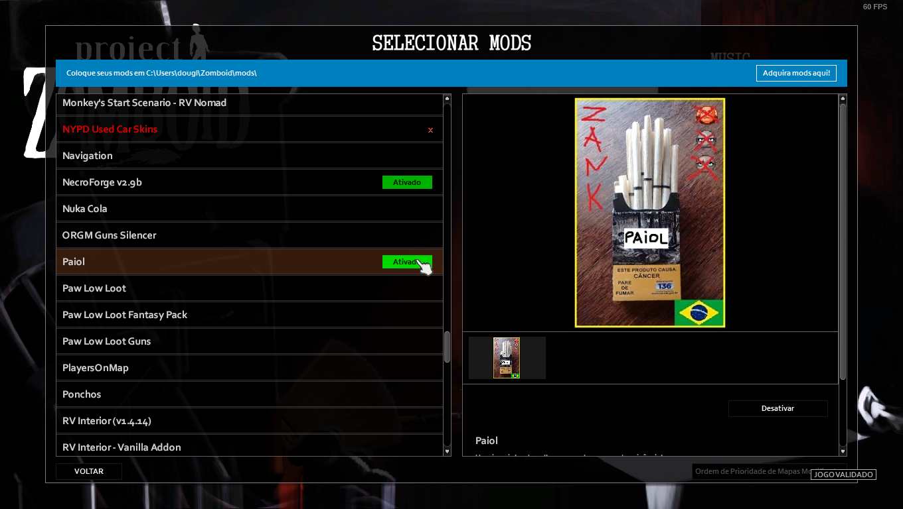
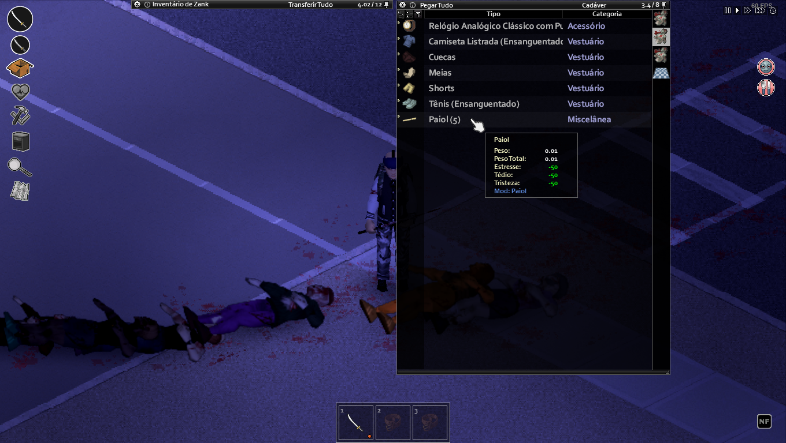

# Paiol Mod - Project Zomboid

- #### Mod feito com a linguagem de programação Lua para a comunidade de Project Zomboid
- #### Versão 1.0
- #### Disponível na Oficina Steam 
https://steamcommunity.com/sharedfiles/filedetails/?id=3203373197&searchtext=paiol

#

*Um Paiol para relaxar na sua sobrevivência!*

*Está Tenso? Entediado ou Triste? que tal um cigarro artesanal para relaxar no fim do mundo...*

*O Paiol pode ser encontrado apenas nos cadáveres.*
*Se quiser encontrar para relaxar... mate!*

#

 - -50% de Estresse
 - -50% de Tédio
 - -50% de Tristeza 
#

### 1 - Inscreva-se na oficina da Steam.

#

### 2 - Ative o mod no Game.

#

### 3 - Encontre o Paiol no Project Zomboid e relaxe... :D.

#

 
